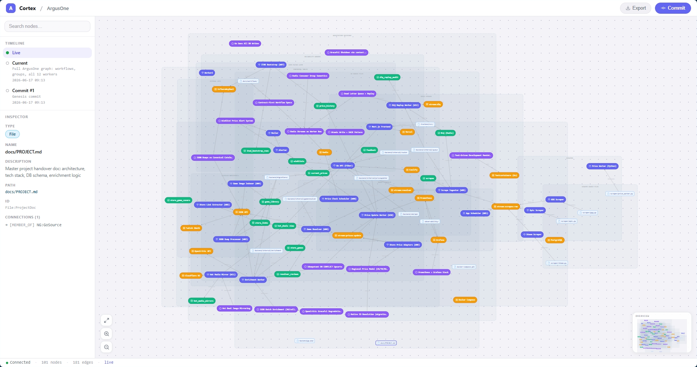
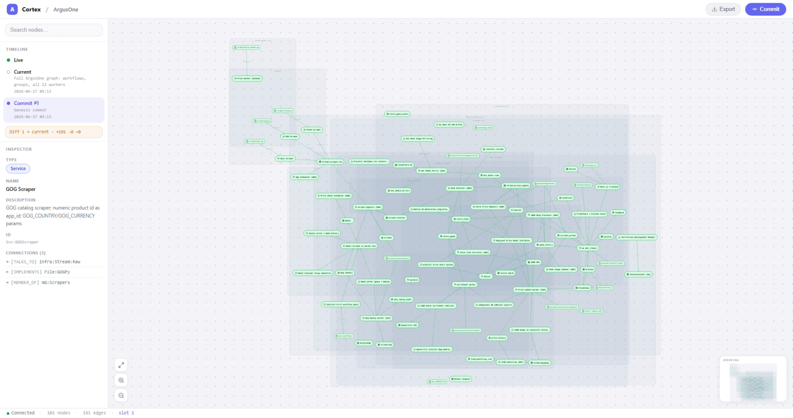
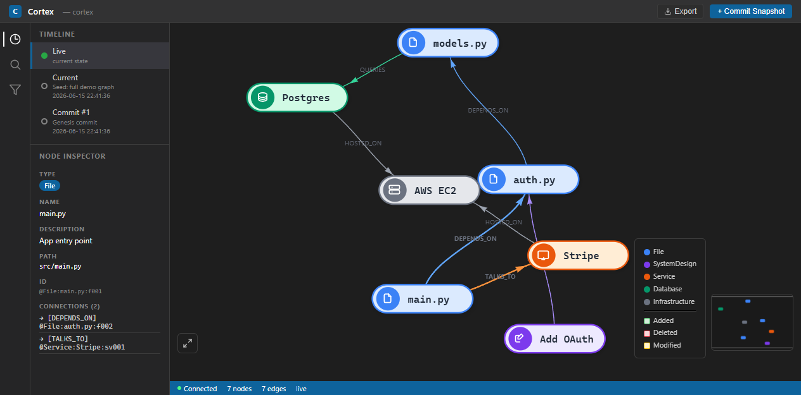
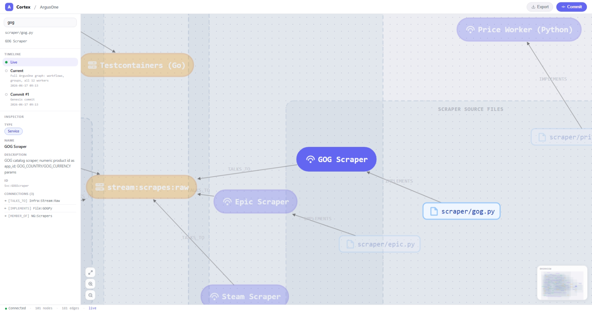

# Cortex

A local knowledge graph that keeps AI agents oriented in your codebase.



Cortex maps your project into a queryable graph — files, services, databases,
infrastructure, and architectural decisions — and exposes it to AI agents via
MCP so they never need to grep or glob to understand your codebase. The web UI
lets you explore the graph and review what the AI documented over time.

---

## Quick Install

**macOS / Linux:**

```bash
curl -sSL https://raw.githubusercontent.com/AlpDurak/cortex/master/install.sh | bash
```

**Windows (PowerShell):**

```powershell
irm https://raw.githubusercontent.com/AlpDurak/cortex/master/install.ps1 | iex
```

The installer clones Cortex into `~/.cortex/cortex`, creates a Python venv,
installs dependencies, adds the `cortex` command to your PATH for new terminals
(CMD/PowerShell on Windows, bash/zsh on macOS and Linux), and auto-configures any
of these AI tools it finds on your machine:

- Claude Code (`~/.claude/settings.json`)
- Cursor (`~/.cursor/mcp.json`)
- Gemini CLI (`~/.gemini/settings.json`)
- Codex CLI (`~/.codex/config.json`)

---

## Usage

### Initialize a project
```bash
cortex init
```

### Start the web UI
```bash
cortex run              # http://localhost:7842
cortex run --port 8000  # custom port
```

### MCP server (for AI tools)
```bash
cortex mcp              # stdio transport (used by AI tool configs)
cortex mcp --sse        # SSE transport (for debugging)
```

### Install Cortex into AI tool MCP configs
```bash
cortex connect          # interactive checkbox installer
```

### Enable automatic git snapshots (Anchored Commits)
```bash
cortex hook install     # installs post-commit hook
cortex hook status      # check if hook is active
cortex hook uninstall   # remove the hook
```

### Push graph to an external graph database
```bash
cortex relay neo4j --cypher-only                                        # preview Cypher
cortex relay neo4j --uri bolt://localhost:7687 --password secret
cortex relay falkordb --host localhost --port 6379
```

### Export the graph
```bash
# Via the web UI: click Export → choose format
# Via REST API:
curl -s -X POST http://localhost:7842/api/export \
  -H 'Content-Type: application/json' \
  -d '{"format": "graphml"}' > graph.xml
```

### Optional extras
```bash
pip install cortex[analysis]   # Leiden algorithm for Signal Clusters
pip install cortex[neo4j]      # Neo4j relay driver
pip install cortex[falkordb]   # FalkorDB relay driver
```

---

## How the graph works

Cortex stores the graph in a `.cortex/` directory inside your project. It keeps
5 rolling snapshots so you can browse history and diff any two versions.



Use the Timeline panel in the web UI to navigate between snapshots. Click any
historical slot to mount it as an overlay — added nodes appear green, deleted
nodes appear red/dashed, modified nodes appear orange.

---

## Node inspector

Click any node to open the inspector panel. SystemDesign nodes show section,
status badge, and architectural rationale.



---

## Node search

Use the Search panel (magnifying glass icon) to find nodes by name or ID.



---

## MCP tools reference

| Tool                                         | Description                               | When to use                   |
| -------------------------------------------- | ----------------------------------------- | ----------------------------- |
| `list_design_sections`                       | All SystemDesign nodes grouped by section | Session start, re-orientation |
| `explore_neighborhood(node_id, depth)`       | Node + its connections up to N hops       | Understand a component        |
| `find_structural_path(src_id, dst_id)`       | Shortest path between two nodes           | Trace dependencies            |
| `get_graph_timeline()`                       | Snapshot history with timestamps          | See what changed when         |
| `query_graph_diff(from_version, to_version)` | Added/deleted/modified nodes and edges    | Understand a change           |
| `write_system_design_node(...)`              | Create or update a SystemDesign node      | Document architecture         |

---

## Manual MCP configuration

If the installer didn't configure your tool, add this entry to your tool's MCP config:

```json
"cortex": {
  "command": "/absolute/path/to/cortex/.venv/bin/python",
  "args": ["-m", "cortex.mcp_server"]
}
```

Set `cwd` to your project directory (or `${workspaceFolder}` if your tool supports it).
The server resolves the project root from its working directory at startup.

---

## Requirements

- Python 3.11+
- git

---

## License

MIT
